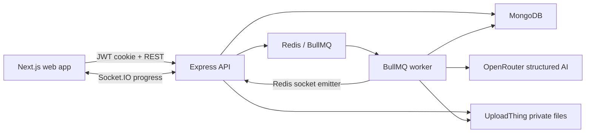

# VedaAI

VedaAI is a teacher-facing AI assessment creator built for the VedaAI Full Stack Engineering assignment. It follows the supplied Figma screens with a quiet grayscale workspace, focused orange actions, a mobile navigation treatment, and a document-style question paper view.

## What Is Included

- Administrator and teacher authentication with expiring invitation links.
- Assessment creation with validation, question totals, study-material upload, and generation preferences.
- Private UploadThing storage for source documents and generated PDFs.
- BullMQ workers for document extraction, OpenRouter assessment generation, and PDF export.
- Socket.IO progress updates and immutable paper revisions for regeneration and manual changes.
- Student-paper and teacher-answer-key PDF exports in a protected access flow.
- Dashboard, history, empty/loading states, responsive paper view, and workspace member management.

## Architecture



The API creates durable assignment and run records before queueing work. Workers never expose an LLM response directly: generated JSON is schema-constrained at OpenRouter, parsed with shared Zod contracts, checked against required marks and question counts, then written as an immutable revision.

Files use UploadThing private ACL. The database stores file keys; browser access goes through authenticated VedaAI endpoints that create short-lived signed URLs after workspace authorization. This matters for uploaded learning material and teacher answer keys.

## Repository

```text
apps/web              Next.js 15 frontend
apps/api              Express API, Socket.IO server and BullMQ worker
packages/contracts    Shared Zod input, AI and event schemas
packages/ui           Small Shadcn-style UI primitive library
docker-compose.yml    MongoDB, Redis, API, worker and web services
```

## Local Setup

Prerequisites: Node.js 20+ and Docker Desktop for MongoDB/Redis, or reachable MongoDB and Redis instances.

1. Install dependencies:

   ```bash
   npm install
   ```

2. Create configuration:

   ```bash
   cp .env.example .env
   ```

3. Supply required credentials in `.env`:

   - `OPENROUTER_API_KEY` and a structured-output-capable `OPENROUTER_MODEL`.
   - `UPLOADTHING_TOKEN`; enable ACL overrides in UploadThing because uploaded material and PDFs are private.
   - long random `JWT_ACCESS_SECRET` and `JWT_REFRESH_SECRET` values.

4. Start infrastructure and application:

   ```bash
   docker compose up mongodb redis -d
   npm run dev
   npm run worker
   ```

5. Open [http://localhost:3000](http://localhost:3000). Swagger is available at [http://localhost:4000/docs](http://localhost:4000/docs), with service probes at `/health` and `/ready`.

## Environment

`NEXT_PUBLIC_API_URL` must be visible to the browser. The API requires MongoDB, Redis, JWT secrets, OpenRouter, UploadThing, and `WEB_ORIGIN`. The API intentionally refuses to start without AI and private file configuration; generated papers are never replaced with fake provider output.

## Workflows

1. An administrator signs up and creates a school workspace.
2. The administrator shares an expiring teacher invite link.
3. A teacher builds an assessment and optionally attaches a PDF, TXT, or DOCX source.
4. UploadThing stores the file privately; a worker extracts readable context.
5. OpenRouter generates strict structured sections and questions; live events update the UI.
6. The teacher edits or regenerates content as new revisions and downloads a protected student paper or answer-key PDF.

## Testing

```bash
npm run test
npm run typecheck
npm run build
```

Tests cover shared validation arithmetic and interactive stepper boundaries as a base. The architecture isolates API services and workers for further mocked OpenRouter, Redis, MongoDB, file authorization, and Playwright coverage.

## Deployment

- Deploy `apps/web` to Vercel with `NEXT_PUBLIC_API_URL` set to the public Railway API URL.
- Deploy the `apps/api` Dockerfile twice on Railway: once with the default API command, once with `node apps/api/dist/worker.js`.
- Connect both Railway services to MongoDB Atlas and managed Redis using identical application secrets.
- Set `WEB_ORIGIN` to the Vercel origin and configure UploadThing callback/API origins for the deployed Express host.

## Tradeoffs

- PDFMake is used server-side instead of printing browser HTML, producing stable school-paper formatting and controlled answer-key variants.
- Revisions are immutable so regenerating one question never silently destroys a teacher's earlier paper.
- The first release supports administrator and teacher roles; student delivery and grading are outside this assignment's assessment-authoring scope.
- The code favors direct services and explicit schemas over a heavy abstraction layer so a reviewer can follow each production boundary quickly.
